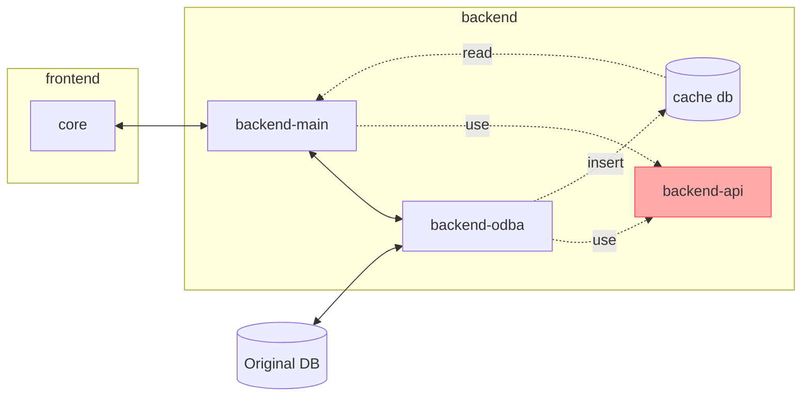

# 279map-backend-api

279map-backend-api is a common module shared by `backend-main` and
`backend-odba`.

It defines the API contracts used for communication between the two
backend modules and provides common utilities for implementing those APIs.

The API contracts include:

- API endpoint URI
- HTTP method
- Request parameter type
- Response type

Both `backend-main` and `backend-odba` use the same API definitions,
allowing the communication contract to be managed in a single place.

279map-backend-api is maintained as an independent Git repository and is
included in `backend-main` and `backend-odba` as a Git submodule.
This allows the backend modules to share the same version of the API
definitions while keeping their source code repositories independent.

